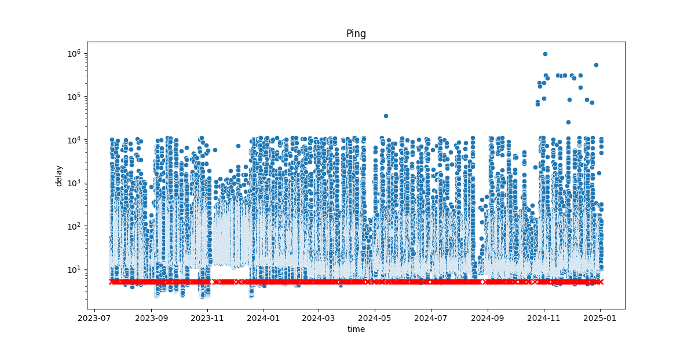

# PING Logger
## Description
Those are simple bash and python scripts to log ping results to a file.
Also contains a script to plot the results to a scatter plot.

## Usage
Add the following line to your crontab:
```
*/5 * * * * /path/to/pinger.sh 2>&1
```
The number 5 is the interval in minutes. 
Meaning tht the script will be executed every 5 minutes.
Feel free to change it to your needs.

## Dependencies
* python3
* numpy
* seaborn
* pandas
* matplotlib

## Example


## License
GNU GPLv3


